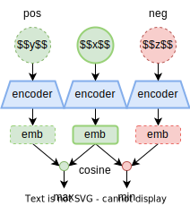
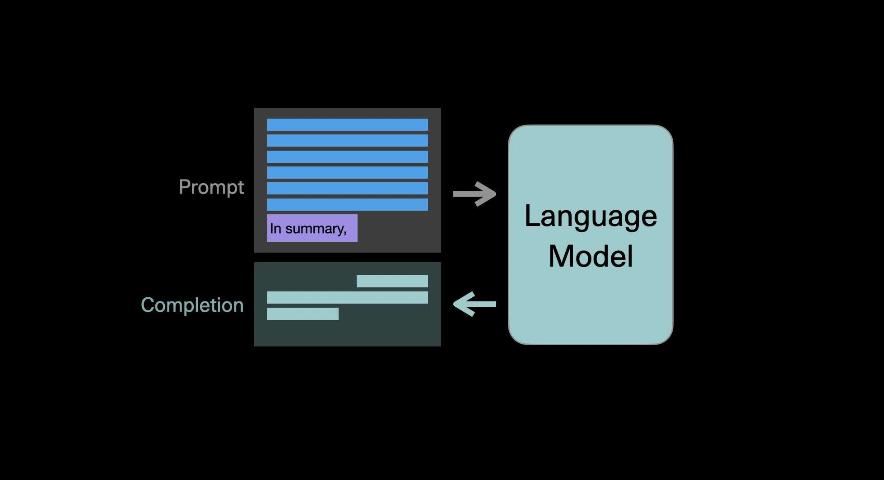
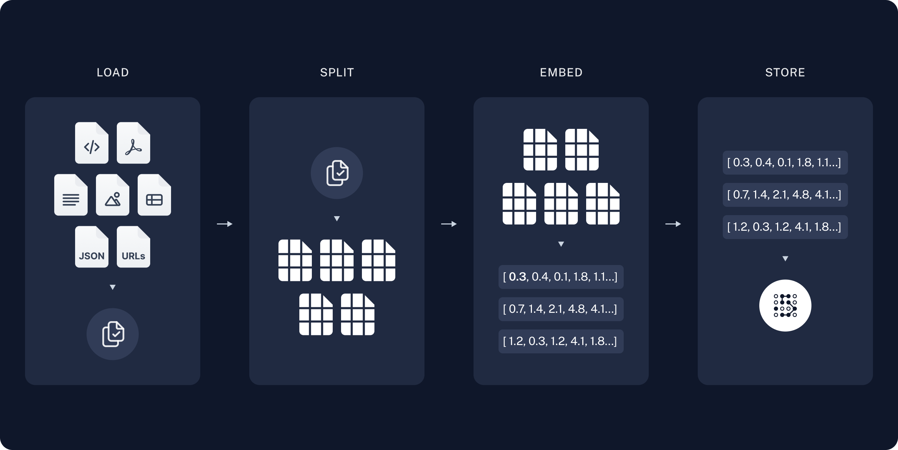
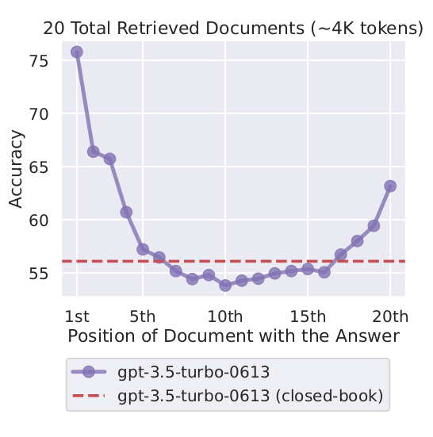

<style>
img[alt~="center"] {
  display: block;
  margin: 0 auto;
}
section::after {
  content: attr(data-marpit-pagination) '/' attr(data-marpit-pagination-total);
}
</style>

# Text Embedding. Text Retrieval & Ranking. Retrieval-Augmented Generation.

###### Alekseev Ilya, EFML, Fall 2024.

---

# Text Embedding

## Outline

- Text Embedding & Sequence-level Tasks
- BERT Embedding
- SBERT
- Contrastive Learning: Loss, Positives, Negatives

---

## Text Embedding

*Embedding must be useful as **feature representation** and for **vector search***.


---

## Sequence-level Tasks

- **Natural Language Inference (NLI)**: contradiction, eintailment, and neutral (pair classification)
- **Bitext Mining**: mine closest translation pairs from parallel corpus (knn)
- **Semantic Textual Similarity (STS)**: estimate the similarity of two texts (pair regression)
- **Retrieval**: find relevant documents for query text (knn)
- **Parahpase detection** (pair classification)
- Classification, clustering, reranking, summarization

---

## BERT Embedding

Feed to BERT and pool last hidden states:
- CLS
- Average
- Attention


---

# BERT is not trained to produce good embeddings!


---

# We need **sentence-level** task to encourage model to aggregate info effectively

Reimers & Gurevych, "Sentence-BERT: Sentence Embeddings using Siamese BERT-Networks", EMNLP 2019 (citations: 12866)

Sequence-level task: *train BERT on NLI data*.

---

## SBERT


---

## SBERT: pros and cons

➕ sequence-level task
➕ bottleneck trick
➖ supervised data
➖ only features but not a vector search 

---

## Contrastive Learning

$$
\mathcal{L} = -\log\frac{\exp({\cos (x, y)})} {\sum_{z\in Z} \exp{(\cos(x, z))}}
$$




---

## How to Mine Positives

- supervised datasets (NLI, STS, summarization, retrieval)
- scrapped data (QA forums, Reddit threads, web articles, news)
- augmentations (synonyms, paraphasing, dropout, token shuffling)

---

## How to Mine Negatives

- in-batch negative sampling
- queue
- memory bank
- momentum contrast (MoCo)

---

## In-batch Negative Sampling

```python
# joint embedding
x_emb = encoder(x_txt)  # [B, d]
y_emb = encoder(y_txt)  # [B, d]

# pairwise cosine similarities
x_emb = F.normalize(x_emb, dim=1)
y_emb = F.normalize(y_emb, dim=1)
similarities = x_emb @ y_emb.T  # [B, B]

# symmetric loss
labels = torch.arange(len(x_emb))
loss_r = F.cross_entropy(similarities, labels, reduction='mean')
loss_c = F.cross_entropy(similarities.T, labels, reduction='mean')
loss = (loss_c + loss_r) / 2
```

---


---

## SOTA Embedding Models

https://huggingface.co/spaces/mteb/leaderboard

---

## Text Embedding: Summary

- Text Embedding & Sequence-level Tasks
- BERT Embedding
- SBERT
- Contrastive Learning: Loss, Positives, Negatives

---

# Text Retrieval & Ranking

## Outline

- Symmetric vs Asymmetric Search
- Bi-encoder vs Cross-encoder
- Sparse Text Embedding: BM25

---
## Retrieval Types

- **symmetric** search (clustering, knn, bitext mining)
    - query $\sim$ document
    - `q="The last time the survey was conducted, in 1995, those numbers matched."`
    - `d="In 1978, the paper's numbers weren't believed to be true."`
- **asymmetric** search (web search, QA)
    - query $\not\sim$ document
    
    - `q="What is Python"`
    - `d="Python is an interpreted, high-level and general-purpose programming language."`

---

## Search Engine


---

## Bi-encoder


---

## Cross-encoder


---

## Sparse Text Embedding

Вектор $e(d)$ размера $|V|$:

- BoW:
$$
[e(d)]_i=\text{tf}(w_i,d)
$$
- TF-IDF
$$
[e(d)]_i=\text{tf}(w_i,d)\cdot\text{idf}(w_i)
$$

- BM25
$$
[e(d)]_i=\widetilde{\text{tf}}(w_i,d)\cdot\widetilde{\text{idf}}(w_i)
$$

---

## TF-IDF

- term frequency $\text{tf}(w,d)$ есть число вхождений токена $w_i$ в документ $d$
- document frequency $\text{df}(w)$ есть число документов, в которых встречается $w$
- inverse document frequency есть мера редкости токена:
$$
\text{idf}(w)=1+\log{1+|D|\over1+\text{df}(w)}
$$
- вместе дает число токенов с учётом редкости каждого токена:
$$
[e(d)]_i=\text{tf}(w_i,d)\cdot\text{idf}(w_i)
$$

---

## BM25

- пусть $\ell(d)$ это отношение длины $d$ к средней длине документов в датасете
- term frequency с поправкой на длину документа:
$$
\widetilde{\text{tf}}(w,d)={3\cdot\text{tf}(w)\over 3(0.25+0.75\cdot\ell(d))+\text{tf}(w)}
$$
- inverse document frequency
$$
\widetilde{\text{idf}}(w_i)=\log{|D|-\text{df}(w)+0.5\over\text{df}(w)+0.5}
$$
- вместе это дает число токенов с учетом редкости, длины текста, числа повторений этого токена
$$
[e(d)]_i=\widetilde{\text{tf}}(w_i,d)\cdot\widetilde{\text{idf}}(w_i)
$$

---

## Text Retrieval & Ranking: Summary

- Symmetric vs Asymmetric Search
- Search Engine Pipeline
- Bi-encoder vs Cross-encoder
- Sparse Text Embedding: BM25

---

# Retrieval Augmented Generation

## Outline

- Introduction. Naive RAG
- Evaluation
- Improve RAG. Prompting Techniques
- Improve RAG. Retriever and LLM Joint Training

---

# Introduction. Naive RAG

---

## Language Models are Few-Shot Learners 

GPT-3 [Brown et al., 2020]

> ...tasks which require using the information stored in the model’s parameters to answer general knowledge questions.


---


## QA via Prompt Completion

Problems of simple generation:
- hallucinations, missing references
- hard to update

<!--  -->


Solution: **retrieval-augmented generation (RAG)**

---

## Naive RAG

- retrieve documents relevant to query (user's input)
- insert top-k documents into prompt
- feed as prompt


---

## Knowledge Stores

- web pages
- PDF, word, markdown (closed-book)
- wikipedia dump
- search engines

---

## Implementation: LangChain



---

## Implementation: LangChain

- choose SOTA LLM (Chatbot Arena)
- choose SOTA embedder (MTEB)

See also: [LlamaIndex](https://docs.llamaindex.ai/en/stable/index.html).


---

# Evaluation

- Knowledge-intensive tasks
- RAG-specific benchmarks

---

## RAGAs [Es et al., 2023]

Automated evaluation with LLM as assesor.


---

## RAGAs [Es et al., 2023]


---

## Improve Your RAG

- choose SOTA embedder and LLM according to public leaderboards
- prompting techniques
- train retriever and generator jointly

---

## Prompting Techniques

- query summarization / paraphrasing 
- decompose into multiple questions (Chain-of-Thought)
- reranking chunks

---

## Prompting Techniques: Chain-of-Thought


---

## Prompting Techniques: Rerank Chunks

Lost in the middle [Liu et al., 2023]



---

## Train Retriever and Generator Jointly

- RAG [Piktus et al., 2020], BART + DPR
- Hindsight [Paranjape et al., 2022], BART + Colbert
- Atlas [Izacard et al., 2022], T5 + Contriever
- Replug [Shi et al., 2023], GPT-3 + Contriever
- RA-DIT [Lin et al, 2023], Llama 2 + DRAGON

Meta AI almost everywhere!

---

## RAG: Summary

- Introduction. Naive RAG
- Evaluation
- Improve RAG. Prompting Techniques
- Improve RAG. Retriever and LLM Joint Training
